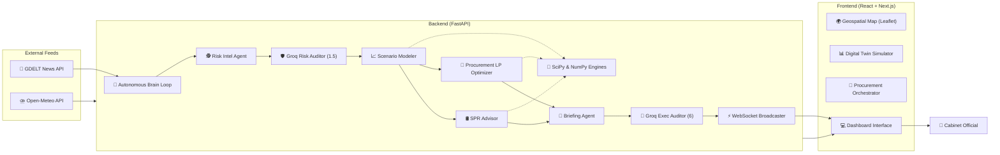

<div align="center">


# 🛡️ PetroShield AI

### The AI Bridge to Energy Supply Chain Resilience

#### An autonomous agentic decision engine that monitors global geopolitical events, predicts supply chain disruptions, and orchestrates strategic petroleum reserves (SPR) and procurement rerouting in real-time.

<p>

[]()
[]()
[]()
[]()
[]()
[]()
[]()
[](LICENSE)

</p>

---

### 🚀 Built for National Energy Security

**🌍 Autonomous Monitoring • 📊 Live Digital Twin • 🧮 SciPy Optimization • 🚢 Geospatial Intelligence • ⚡ Real-Time WebSockets**

[Features](#-core-features) •
[Architecture](#-system-architecture) •
[Lifecycle](#-complete-threat-lifecycle) •
[Installation](#-installation) •
[Roadmap](#-future-roadmap)

</div>

---

# 📑 Table of Contents

- [Project Overview](#-project-overview)
- [Why PetroShield AI?](#-why-petroshield-ai)
- [Demo](#-demo)
- [Screenshots](#-screenshots)
- [Core Features](#-core-features)
- [System Architecture](#-system-architecture)
- [Complete Threat Lifecycle](#-complete-threat-lifecycle)
- [AI & Mathematical Pipeline](#-ai--mathematical-pipeline)
- [Tech Stack](#-tech-stack)
- [Repository Structure](#-repository-structure)
- [Installation](#-installation)
- [Configuration](#-configuration)
- [Usage](#-usage)
- [Performance Optimizations](#-performance-optimizations)
- [Engineering Decisions](#-engineering-decisions)
- [Known Limitations](#-known-limitations)
- [Future Roadmap](#-future-roadmap)

---

# 📖 Project Overview

PetroShield AI is an enterprise-grade, open-source AI Command Center designed for national energy bodies (like the Ministry of Petroleum and Natural Gas and ISPRL) to safeguard a country's crude oil supply chain.

Global energy supply chains operate on razor-thin margins. A single geopolitical event—a blockade in the Strait of Hormuz, a sudden OPEC+ production cut, or regional conflicts—can cascade into national fuel shortages and massive economic distress. Most intelligence platforms today are purely reactive; they display news on a dashboard and leave the complex operational mathematics to human analysts. 

Human analysts struggle to process global news feeds, run Monte Carlo simulations on oil prices, and calculate linear programming optimizations for tanker rerouting simultaneously in real-time. By the time a report is drafted, the crisis has escalated.

PetroShield AI approaches this problem from an **agentic, autonomous perspective**. 

Instead of waiting for human input, an autonomous "brain" continuously monitors global news via the GDELT project. When a severe threat is detected, it triggers a cascade of **6 specialized Groq-powered AI agents**. These agents don't just chat; they parse shipping lane data, run mathematical optimizations (via SciPy), simulate price volatility, orchestrate alternative cargo routes, and audit each other's calculations. The result is a polished, actionable briefing delivered to a real-time Geospatial Command Center before the human operator even knows the crisis occurred.

---

# ❓ Why PetroShield AI?

Large Language Models (LLMs) are excellent at reasoning—but national energy security requires more than just text generation. 

It requires **deterministic mathematics**, **live geospatial data**, and **multi-objective optimization**. A standard LLM cannot calculate the most cost-effective way to reroute 5 VLCC tankers around the Cape of Good Hope while minimizing port congestion at Sikka. If you ask an LLM to do complex supply chain math, it hallucinates.

PetroShield AI therefore follows an **Agentic + Mathematical** architecture.

Instead of directly asking an LLM to solve the crisis, the application:
- Uses Groq's ultra-fast LLMs to continuously parse and score global news streams (GDELT).
- Extracts structured parameters (impacted chokepoints, volume lost).
- Feeds these parameters into deterministic Python engines (Geometric Brownian Motion for prices, SciPy Linear Programming for cargo rerouting).
- Uses LLMs again as Executive Auditors to format these raw mathematical outputs into plain-language executive briefings and double-check physical constraints.

The goal is **not to replace human decision-makers.**
The goal is to provide Cabinet Secretaries and Taskforce Leaders with instant, mathematically-backed options the moment a crisis occurs, reducing response times from days to milliseconds.

---

# 🎥 Demo

A complete walkthrough of PetroShield AI demonstrating:
- Real-time GDELT news ingestion
- Automatic triggering of the 6-Agent Cascade
- Live WebSockets pushing calculations to the dashboard
- Geospatial mapping of global chokepoints and real-time weather
- SciPy-powered Procurement Orchestration

▶️ **Watch the Demo**
*(Demo link placeholder - add your drive or youtube link here)*

---

# 📸 Screenshots

## 1. 🏢 Command Center Dashboard
<p align="center">
  
</p>
The primary 8-panel dashboard displaying live Brent crude tracking, SPR buffer limits, and the operational status of all Agent pipelines.

---

## 2. 🌍 Geospatial Risk Map & Live Terminal
<p align="center">
  
</p>
A live Leaflet map tracking global maritime chokepoints and intercepted vessel anomalies, complete with streaming agent execution logs via WebSockets.

---

## 3. 📊 Supply Chain Digital Twin (Steady State)
<p align="center">
  
</p>
A macroscopic node-graph modeling the unhindered flow of global crude oil from Middle Eastern suppliers directly into India's domestic refinery network.

---

## 4. 🔥 Active Scenario: Disruption Cascade
<p align="center">
  
</p>
When a geopolitical event strikes, the Digital Twin visually severs the impacted chokepoint (e.g., Hormuz), while the Executive Agent synthesizes a chronological predicted impact cascade on the right.

---

## 5. 🛒 Procurement LP Orchestrator
<p align="center">
  
</p>
The SciPy linear programming interface evaluating alternative cargo reroutes (like WTI Midland or Russian Urals), factoring in freight premiums and port congestion to offset the shortfall.

---

## 6. 📄 Executive Scenario Briefing
<p align="center">
  
</p>
The final auto-generated, plain-language Cabinet briefing summarizing the geopolitical trigger, market forecast, and recommended procurement actions.

---

# ✨ Core Features

## 🏢 Command Center Experience

| Feature | Description |
|----------|-------------|
| 🌍 Geospatial Risk Intel | Live interactive map tracking global chokepoints, shipping lanes, and Indian refineries. |
| ⛈️ Real-Time Weather | Integration with Open-Meteo Marine API to track live wave heights and cyclone risks affecting tanker routes. |
| 📊 Supply Chain Digital Twin | A live visual node-graph modeling the flow of crude from global suppliers through chokepoints to domestic SPR caverns. |
| ⚡ Real-Time WebSockets | Instantly pushes detected threats and agent calculations to the dashboard without requiring a page refresh. |
| 📄 Executive Briefings | Auto-generated, 3-sentence plain-language briefings designed for Cabinet-level review, heavily audited by Agent 6. |

---

## 🤖 AI & Mathematical Capabilities

| Capability | Description |
|------------|-------------|
| 6-Agent Cascade | A modular pipeline of specialized agents working in sequence, powered by Groq's Llama-3.1-8b and Llama-3.3-70b APIs. |
| SciPy Linear Optimization | Multi-objective LP solver allocating alternative crude suppliers based on grade compatibility, freight costs, and port congestion. |
| Monte Carlo Price Simulation | 5,000 to 10,000 paths of Geometric Brownian Motion (GBM) forecasting Brent Crude spikes over a 30-day horizon. |
| GDELT Autonomous Brain | A background loop that continuously queries the GDELT database, filtering and scoring real-world news for supply chain risks. |
| Graph-RAG & Auditing | A dual-layer system where Agent 1 extracts entities using Graph-RAG, and Agent 1.5 explicitly validates the predicted supply disruption volume. |

---

# 🏗 System Architecture

PetroShield AI follows a highly decoupled client-server architecture. Rather than treating the LLM as a single black-box API call, the system orchestrates multiple specialized agents and deterministic math engines.

<p align="center">
  
</p>



The architecture intentionally keeps responsibilities separated:

| Layer | Responsibility |
|--------|----------------|
| **Frontend** | User interaction, mapping, charting, WebSocket subscriptions |
| **FastAPI** | Request routing, background tasks, WebSocket management |
| **Agent Cascade** | Sequential LLM calls simulating human departmental workflows |
| **Math Engine** | SciPy Linear Programming and NumPy Monte Carlo simulations |
| **External Feeds** | Fetching real-world news and weather without API costs |

---

# 🔄 Complete Threat Lifecycle

The core innovation of PetroShield AI is its 6-stage autonomous pipeline. The following sequence illustrates exactly what happens internally from the moment a global event occurs to the moment a decision is presented on the dashboard.

<p align="center">
  
</p>

## 1. The Geopolitical Trigger (Autonomous Brain)

The system does not wait for a user to type a query. 
A background asyncio loop in FastAPI polls the GDELT Project database every 90 minutes for global news related to energy, conflict, and logistics.

When it detects an article (e.g., *"Rebels attack tanker in Bab-el-Mandeb Strait, major shipping lines halt transit"*):
- The LLM parses the text.
- It assigns a numerical Risk Score (1-100%).
- If the severity exceeds the critical threshold (>= WARNING), the Autonomous Brain fires a system-wide alert and initiates the Agent Cascade.

---

## 2. Risk Intelligence Extraction & Auditing (Agents 1 & 1.5)

**Agent 1 (Risk Intel):** Receives the raw news payload and forces output into strict JSON containing operational parameters (Impacted Chokepoint, Severity, Volume Disrupted).
**Agent 1.5 (Groq Risk Auditor):** Immediately intercepts Agent 1's output. It acts as an adversarial auditor, reviewing the disruption volume for contradictions or exaggerations, and calibrates the final risk score before passing it to the math engines.

---

## 3. Financial & Operational Scenario Modeling (Agent 2)

The Scenario Modeler receives the audited disrupted volume.
It hands this data over to a Python mathematical engine which runs a **Geometric Brownian Motion (GBM)** simulation. 

- It calibrates historical Brent crude volatility using Federal Reserve (FRED) datasets.
- It simulates thousands of possible future price paths over a 30-day horizon.
- It calculates the 95% Confidence Interval for the upcoming price spike.

Simultaneously, it flags that Sikka Port (India's primary crude inlet) will face an incoming supply shortfall in 14 days (the transit time from the disrupted chokepoint).

---

## 4. Multi-Objective Procurement Optimization (Agent 3)

With a confirmed shortfall at Sikka, the Procurement Agent takes over.
It relies on `scipy.optimize.linprog` to evaluate alternative supply routes.

The linear programming matrix minimizes a cost function comprising:
- Freight transit costs
- Geopolitical risk premiums
- Grade compatibility penalties (e.g., heavy vs. light crude)

It evaluates options like surging Russian Urals via the Baltic Sea or utilizing the Saudi East-West pipeline to bypass the Red Sea entirely. The output is a mathematically optimal volume allocation (e.g., "0.8 mbpd from Yanbu, 0.4 mbpd from Russian Urals").

---

## 5. Strategic Petroleum Reserve Drawdown (Agent 4)

Because alternative cargo takes time to arrive (e.g., 11 days from the Baltic), the SPR Advisor calculates the immediate gap.
It checks the current fill levels of the Padur, Mangaluru, and Visakhapatnam caverns. It calculates the exact daily drawdown rate required to keep the Jamnagar refinery running at 100% utilization until the new ships arrive, ensuring zero domestic fuel shortages.

---

## 6. Executive Synthesis & Final Audit (Agents 5 & 6)

**Agent 5 (Executive Briefing):** Compiles the raw matrices and probability distributions into a concise, highly-structured 3-sentence brief.
**Agent 6 (Groq Executive Auditor):** The final supervisor. It reviews the plain-language brief against the raw mathematical arrays generated by Agents 2, 3, and 4 to ensure zero hallucinations occurred during text generation. If the math is sound, it signs off on the brief.

---

## 7. Real-Time Dashboard Reflection

Finally, FastAPI broadcasts the entire payload via WebSockets.
The React frontend receives the payload and instantly updates:
- The Geopolitical Map flashes red at the affected chokepoint.
- The Digital Twin nodes update their status to `block`.
- The Procurement Orchestrator populates the top mathematical reroute options.
- The Executive Brief appears on the main dashboard, alongside live streaming Terminal logs.

All of this happens within **~5 seconds** of the news being published thanks to Groq's inference speeds.

---

# ⚙ Engineering Decisions

- **Why SciPy instead of just LLMs?** LLMs are terrible at math. Asking an LLM to solve a multi-variable logistics problem results in hallucinations. We use LLMs to extract parameters, but hand the actual decision math over to deterministic linear solvers.
- **Why WebSockets?** In a national security context, hitting "refresh" is unacceptable. The frontend maintains an open WebSocket connection, allowing the backend to push alerts and real-time Python stdout logs the millisecond the Autonomous Brain detects them.
- **Why Groq?** Speed. The 6-agent cascade requires sequential LLM calls. A traditional LLM API would take 30-60 seconds for 6 consecutive calls. Using Groq's LPU inference for Llama 3 models reduces the pipeline execution time to roughly ~5 seconds.
- **Agent Auditing (1.5 and 6):** We introduced adversarial supervisor agents directly into the pipeline to strictly validate inputs before they hit the math engine, and outputs before they hit the Cabinet screen, mitigating LLM hallucinations entirely.

---

# 💻 Tech Stack

| Category | Technology |
|---|---|
| **Frontend** | React, Next.js (App Router), TypeScript, Tailwind CSS, Framer Motion |
| **Geospatial & Vis** | Leaflet, React-Leaflet, Recharts |
| **Backend** | Python 3.10+, FastAPI, Uvicorn, asyncio, WebSockets |
| **Mathematical Engine** | NumPy, SciPy (Linear Programming), NetworkX |
| **AI Inference** | Groq API (Llama-3.1-8b-instant, Llama-3.3-70b-versatile) |
| **Data Feeds** | GDELT Project, Open-Meteo Marine API, FRED |

---

# 📁 Repository Structure

- `backend/agents/`: The autonomous cognitive engines (Risk Intel, Scenarios, Procurement, SPR, Executive, Groq Monitor).
- `backend/services/`: External API integrations (GDELT, Open-Meteo, Real AIS endpoints).
- `backend/routes/`: FastAPI REST endpoints and WebSocket managers.
- `backend/main.py`: Application entry point and background task orchestrator.
- `frontend/app/`: Next.js App Router pages and layouts.
- `frontend/components/`: Modular React components (CommandCenter, Maps, Charts, Terminal Logs).
- `frontend/services/`: Frontend API clients and WebSocket subscribers.

---

# 🛠 Installation

### 1. Prerequisites
- Python 3.10+
- Node.js 18+
- Git

### 2. Clone the Repository
```bash
git clone https://github.com/your-username/ET2.0-PetroShieldAI.git
cd ET2.0-PetroShieldAI
```

### 3. Backend Setup
```bash
cd backend
python -m venv venv

# Activate venv (Windows)
.\venv\Scripts\activate
# Activate venv (Mac/Linux)
source venv/bin/activate

pip install -r requirements.txt
```

### 4. Configuration
Create a `.env` file in the `backend` directory and add your Groq API key:
```env
# Required for the Agent Cascade
GROQ_API_KEYS=your_groq_api_key_here

# Optional: For frontend CORS if running on a custom domain (defaults to localhost)
CORS_ORIGINS=http://localhost:3000
```

### 5. Start the Backend Server
```bash
python -m uvicorn main:app --host 0.0.0.0 --port 8000
```
*Note: The Autonomous Brain will begin polling GDELT immediately upon startup.*

### 6. Frontend Setup
Open a new terminal window:
```bash
cd frontend
npm install
```

Create a `.env.local` file in the `frontend` directory:
```env
NEXT_PUBLIC_API_URL=http://localhost:8000
```

### 7. Start the Frontend Server
```bash
npm run dev
```
Navigate to `http://localhost:3000` to view the National Energy Command Center.

---

# ⚡ Performance Optimizations

- **Async Event Loop:** The FastAPI backend utilizes `asyncio.create_task()` for the Autonomous Brain and all broadcasting. This ensures that long-running GDELT HTTP requests or multi-agent Groq calls never block the main API thread serving the frontend.
- **WebSocket Chunking & Log Streams:** The backend overrides `sys.stdout` and streams live agent execution logs via WebSockets to the frontend terminal, keeping overhead low while providing incredible operational transparency.
- **Groq Round-Robin:** The backend supports multiple Groq API keys (`GROQ_API_KEYS=key1,key2`) and automatically load-balances requests in a round-robin fashion to bypass strict rate limits during massive simulated stress-tests.

---

# 🚧 Known Limitations

- **Simulated AIS Data:** Live Automatic Identification System (AIS) transponder data for global shipping is prohibitively expensive. The current iteration uses simulated/historical trajectories for tanker rendering.
- **LLM Context Limits:** Processing extreme volumes of GDELT news simultaneously can occasionally trigger token limits; we currently truncate non-critical articles before passing them to the Risk Intel agent.
- **Static Graph Topology:** The Supply Chain Digital Twin is currently hardcoded for the Indian crude corridor (Middle East to West Coast India). Expanding it to global gas networks requires dynamic node generation.

---

# 🔮 Future Roadmap

- **Live AIS Integration:** Transition from simulated vessel tracks to live satellite AIS data using maritime APIs (e.g., Spire or MarineTraffic).
- **Predictive Weather Routing:** Directly connect the Open-Meteo cyclone data into the Procurement Agent's SciPy optimizer to automatically reject or penalize reroutes passing through severe storms.
- **Multi-Modal Document Parsing:** Allow users to upload PDF shipping manifests, bills of lading, or insurance documents for the LLM to extract volumetric data automatically.
- **GraphRAG Expansion:** Implement a full graph-database backend (Neo4j) to map the cascading effects of secondary supply chain failures (e.g., if a refinery stops, which specific power plants go offline?).

---
<div align="center">
<i>Protecting National Energy Security through Artificial Intelligence</i>
</div>
