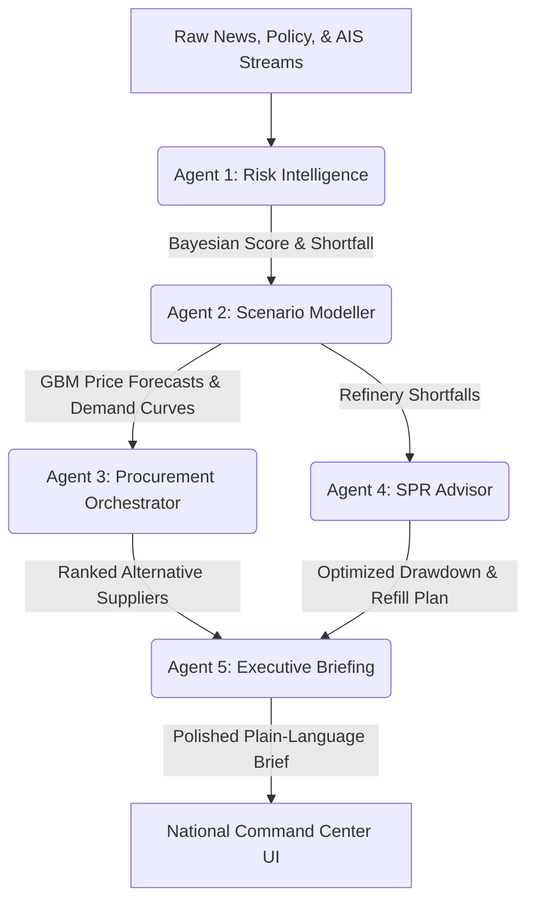

# PetroShield AI
*National Energy Security Command Center – Real-Time Geopolitical Supply Chain Risk & Response Engine*

PetroShield AI is an enterprise-grade AI-powered Command Center designed for the Ministry of Petroleum and Natural Gas (MoPNG) and ISPRL to safeguard India's crude oil supply chain. It continuously monitors geopolitical risks, forecasts down-stream impacts via Monte Carlo simulations, and optimizes alternative supply allocations using multi-objective linear programming.

---

## Key Features & Architecture



### The 5-Agent Cognitive Network
1.  **Risk Intelligence Agent**: Blends keyword weights, prior probabilities, and AIS vessel coordinates to calculate a Bayesian risk index.
2.  **Scenario Modeller Agent**: Calibrates price volatility against historical FRED returns and runs 10,000 Monte Carlo paths of Geometric Brownian Motion (GBM) to forecast Brent spikes.
3.  **Procurement Orchestrator Agent**: Formulates and solves a multi-objective linear programming (LP) system under Scipy to allocate alternative crude suppliers based on grade, cost, transit, and port/tanker congestion constraints.
4.  **SPR Advisor Agent**: Models refinery demand curves (with Q2/Q3 seasonal adjustments) to schedule optimized reserves release, preventing facility shutdowns.
5.  **Executive Briefing Agent**: Compiles a concise, 3-sentence summary highlighting critical figures suitable for the Cabinet Secretary.

---

## Technical Stack & Mathematical Foundations

*   **Backend**: Python, FastAPI, NumPy, SciPy (Linear Programming), NetworkX (Knowledge Graph construction), Uvicorn.
*   **Frontend**: Next.js 16 (App Router), TypeScript, Tailwind CSS, Leaflet.js (GIS Vessel stream), Recharts, Framer Motion.
*   **Mathematical Models**:
    *   **Geometric Brownian Motion (GBM)**: Calibrates daily volatility against FRED Brent returns. Runs Monte Carlo paths to forecast price distributions.
    *   **Multi-Objective Linear Programming (LP)**: Solves for optimal supply allocations minimizing cost, transit time, risk, and congestion constraints.

---

## How to Install & Run

### 1. Prerequisites
- Python 3.10+
- Node.js 18+

### 2. Backend Installation
```bash
cd backend
python -m venv venv
# On Windows:
.\venv\Scripts\activate
# On Linux/macOS:
source venv/bin/activate

pip install -r requirements.txt
```

### 3. Running Backend Services
```bash
python -m uvicorn main:app --host 0.0.0.0 --port 8000 --reload
```
Swagger API docs will be active at `http://localhost:8000/docs`.

### 4. Running Backend Tests
Execute the end-to-end integration and edge-case test suites:
```bash
python scratch/test_pipeline_e2e.py
python scratch/test_edge_cases.py
```

### 5. Frontend Installation
```bash
cd ../frontend
npm install
```

### 6. Running Frontend Development Server
```bash
npm run dev
```
Open `http://localhost:3000` to interact with the National Energy Command Center dashboard.

---

## Project Structure
- `backend/agents/`: Cognitive Agent engines (Risk Intel, Scenarios, Procurement, SPR, Executive, Orchestrator).
- `backend/services/`: Core logic (Knowledge Graph builders, Graph-RAG engines, GBM pricing simulators).
- `backend/data/`: Authenticated shipping lanes (GeoJSON), ports (JSON), and historical Brent price series (FRED CSV).
- `frontend/components/`: CommandCenter UI layout and Leaflet interactive map coordinates.
